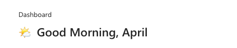

# Welcome Message with Time of Day

This snippet shows how to implement a welcome message in your app that:

- Incorporates the time of day in the welcome message (Morning, Afternoon, Even)

- Displays a custom emoji for the time of day

- Returns the current logged in user's first name

   

## Authors

Snippet|Author(s)
--------|---------
April Dunnam | [GitHub](https://github.com/aprildunnam) ([@aprildunnam](https://www.twitter.com/aprildunnam) )

## Code

```yaml
- TextCanvas3_1:
    Control: Text
    Properties:
      Size: =24
      Text: "=If(\n        Hour(Now()) >= 6 && Hour(Now()) < 12, \"\U0001F324️  Good Morning, \",\n        Hour(Now()) >= 12 && Hour(Now()) < 18, \"☀️  Good Afternoon, \",\n        \"\U0001F319  Good Night, \")\n & Left(User().FullName, Find(\" \", User().FullName) - 1)\n "
      Weight: ='TextCanvas.Weight'.Semibold
      Height: =40
      Width: =500
```

## Minimal path to awesome

1. Open your canvas app in **Power Apps**
1. Copy the contents of the **[YAML-file](./source/welcometimeofday.pa.yaml)** or copy it from the code above.
1. Right click on the screen where you want to add the snippet and select "Paste YAML"


This will add the gallery and header to your screen and you can customize the items property to dynamically get data.


## Disclaimer

**THIS CODE IS PROVIDED *AS IS* WITHOUT WARRANTY OF ANY KIND, EITHER EXPRESS OR IMPLIED, INCLUDING ANY IMPLIED WARRANTIES OF FITNESS FOR A PARTICULAR PURPOSE, MERCHANTABILITY, OR NON-INFRINGEMENT.**


