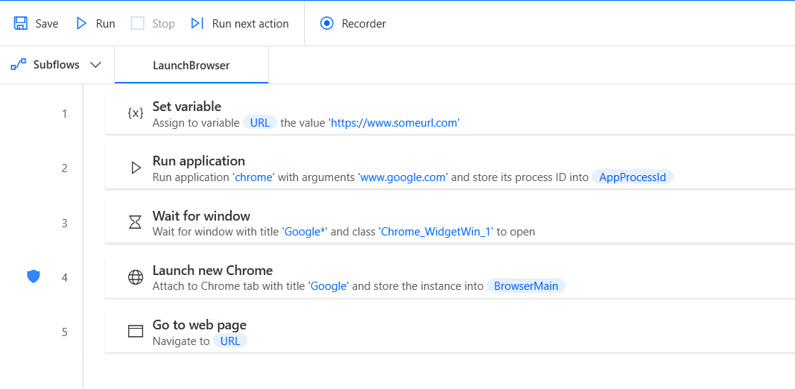
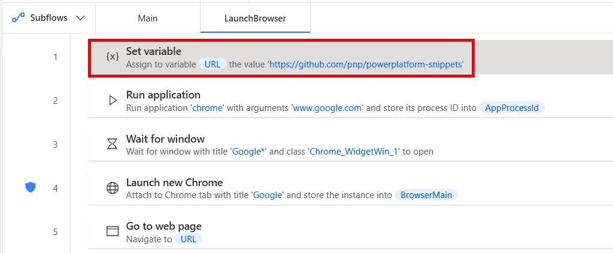
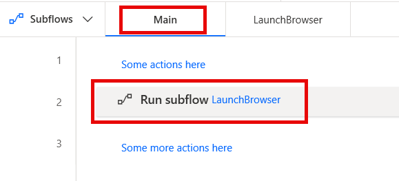

# Launch Browser - Chrome Snippet

This is a snippet that can be used to launch a new instance of the Google Chrome browser that resolves any issues that could occur due to the extension for Chrome failing to load properly.
That is a common issue that makes the **Launch New Chrome** action fail. To avoid that, the snippet can be used to launch the browser via the **Run application** action, and then using **Launch New Chrome** to attach to the open instance.

The code is compatible with Power Automate Desktop version 2.42.317.24061 and later. Backward compatibility is not guaranteed, but it might work with earlier versions, too.

## Minimal path to awesome

1. Open **Power Automate Desktop**
2. Create a new flow or edit an existing flow
3. Create a new subflow called **LaunchBrowser**
4. Copy the code in the **launch-browser.txt** file
5. Paste it into the Power Automate Desktop flow designer window into the new subflow
6. Review the code for any syntax errors

    

7. Replace the **https://www.someurl.com** in the **Set variable** action with an actual URL that you want your flow to navigate to

    

8. Add a **Run subflow** action to your **Main** or whatever other subflow that you want to call **LaunchBrowser** from

    

9. Click **Save** in the flow designer
10. **Enjoy**

## Disclaimer

**THIS CODE IS PROVIDED *AS IS* WITHOUT WARRANTY OF ANY KIND, EITHER EXPRESS OR IMPLIED, INCLUDING ANY IMPLIED WARRANTIES OF FITNESS FOR A PARTICULAR PURPOSE, MERCHANTABILITY, OR NON-INFRINGEMENT.**

